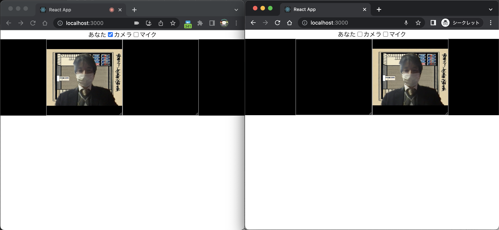

# sample-skyway-react

Reactで開発したビデオ会議のサンプルプログラムです。仮想背景にも対応しています。

## 環境構築

以下のソフトウェアが必要です。

* nodejs

## 起動方法

[SkyWay](https://console-webrtc-free.ecl.ntt.com/users/login)にユーザ登録してキーを発行し，srcディレクトリに`keys.ts`という名前のファイルを作成して以下の内容を書き込んでください。
```
export const skyWayId =  "YOUR_APP_ID";
export const skyWaySecret =  "YOUR_API_KEY";    
export const skyWayRoomId = "YOUR_ROOM_ID"; // 同じskyWayKeyとskyWayRoomIdを使用しているアプリケーションが接続されます。
```
次に以下のコマンドを実行すると，アプリケーションが起動します。
```
npm i
npm run start
```

## 動作画面イメージ



アプリケーションを起動し，2つのブラウザでアクセスした状態を示します。
1つのブラウザ内では，黒い領域に，参加者のカメラ映像が表示されます。
一番左が自分の映像で，他の参加者は右側に表示されます。

